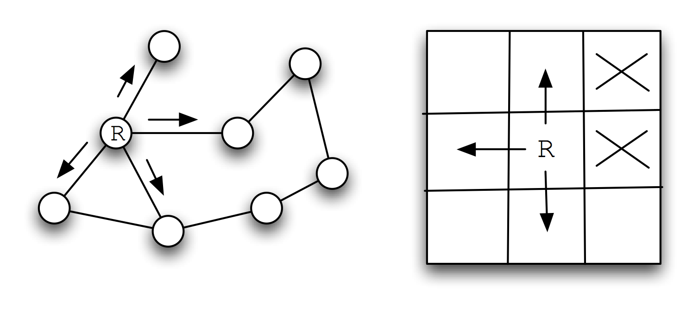

### Chapter 2
Early AI research emphasized the optimization of search algorithms. This approach made a lot of sense because many AI tasks can be solved effectively by defining state spaces and using search algorithms to define and explore search trees in this state space. Search programs were frequently made tractable by using heuristics to limit areas of search in these search trees. This use of heuristics converts intractable problems to solvable problems by compromising the quality of solutions; this trade off of less computational complexity for less than optimal solutions has become a standard design pattern for AI programming. We will see in this chapter that we trade off memory for faster computation time and better results; often, by storing extra data we can make search time faster, and make future searches in the same search space even more efficient.

What are the limitations of search? Early on, search applied to problems like checkers and chess misled early researchers into underestimating the extreme difficulty of writing software that performs tasks in domains that require general world knowledge or deal with complex and changing environments. These types of problems usually require the understanding and then the implementation of domain specific knowledge.

In this chapter, we will use three search problem domains for studying search algorithms: path finding in a maze, path finding in a graph, and alpha-beta search in the games tic-tac-toe and chess.

#### Representation of Search State Space and Search Operators
We will use a single search tree representation in graph search and maze search examples in this chapter. Search trees consist of nodes that define locations in state space and links to other nodes. For some small problems, the search tree can be easily specified statically; for example, when performing search in game mazes, we can compute and save a search tree for the entire state space of the maze. For many problems, it is impossible to completely enumerate a search tree for a state space so we must define successor node search operators that for a given node produce all nodes that can be reached from the current node in one step; for example, in the game of chess we can not possibly enumerate the search tree for all possible games of chess, so we define a successor node search operator that given a board position (represented by a node in the search tree) calculates all possible moves for either the white or black pieces. The possible chess moves are calculated by a successor node search operator and are represented by newly calculated nodes that are linked to the previous node. Note that even when it is simple to fully enumerate a search tree, as in the game maze example, we still might want to generate the search tree dynamically as we will do in this chapter).

For calculating a search tree we use a graph. We will represent graphs as node with links between some of the nodes. For solving puzzles and for game related search, we will represent positions in the search space with Java objects called nodes. Nodes contain arrays of references to both child and parent nodes. A search space using this node representation can be viewed as a directed graph or a tree. The node that has no parent nodes is the root node and all nodes that have no child nodes a called leaf nodes.

Search operators are used to move from one point in the search space to another. We deal with quantized search spaces in this chapter, but search spaces can also be continuous in some applications. Often search spaces are either very large or are infinite. In these cases, we implicitly define a search space using some algorithm for extending the space from our reference position in the space. The figure shows representations of search space as both connected nodes in a graph and as a two-dimensional grid with arrows indicating possible movement from a reference point denoted by R.

A directed graph representation is shown on the left and a two-dimensional grid (or maze) representation is shown on the right. In both representations, the letter R is used to represent the current position (or reference point) and the arrowheads indicate legal moves generated by a search operator. In the maze representation, the two grid cells marked with an X indicate that a search operator cannot generate this grid location.

When we specify a search space as a two-dimensional array, search operators will move the point of reference in the search space from a specific grid location to an adjoining grid location. For some applications, search operators are limited to moving up/down/left/right and in other applications operators can additionally move the reference location diagonally.

When we specify a search space using node representation, search operators can move the reference point down to any child node or up to the parent node. For search spaces that are represented implicitly, search operators are also responsible for determining legal child nodes, if any, from the reference point.

Note that I use different libraries for the maze and graph search examples.

#### Copyright Mark Watson
Practical Artificial Intelligence Programming With Java - Third Edition - Mark Watson Copyright 2001-2008 Mark Watson. All rights reserved. This work is licensed under a Creative Commons Attribution-Noncommercial-No Derivative Works Version 3.0 United States License.